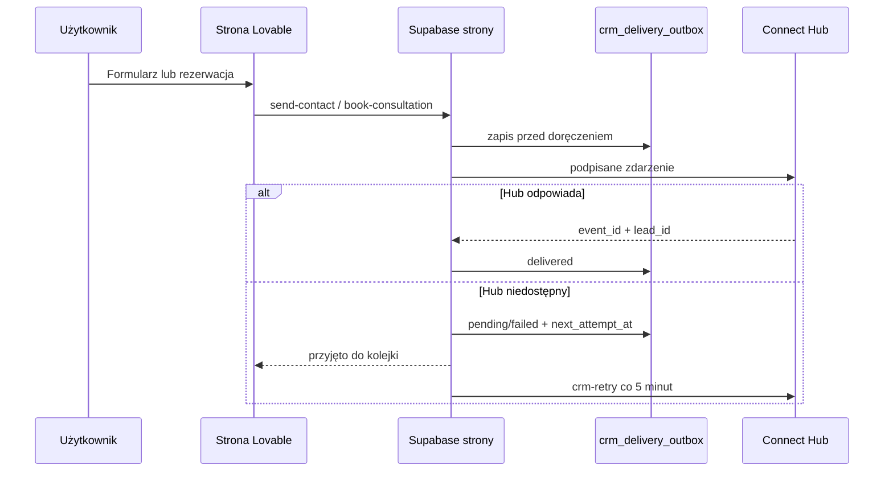

# Strona FOTZ Studio → FOTZ Connect Hub

## Cel

Repozytorium jest źródłem poprawnej strony rozwijanej w Lovable. Formularze i własny kalendarz wysyłają zdarzenia do FOTZ Connect Hub przez funkcje serwerowe. Przeglądarka nie zna sekretu Hub, a chwilowa awaria CRM nie usuwa zgłoszenia.



## Co zostało przygotowane

- `send-contact` zapisuje lead do kolejki przed wysłaniem e-maila.
- `book-consultation` atomowo blokuje termin, kolejkuje zdarzenie CRM i wysyła powiadomienie do FOTZ oraz potwierdzenie do klienta.
- `/konsultacja` używa własnego `BookingCalendar`, więc nie omija CRM przez zewnętrzny widget.
- `booking-availability` zwraca wyłącznie zajęte terminy. Interfejs blokuje wybór, jeśli dostępność nie została potwierdzona.
- Serwer przyjmuje wyłącznie dni robocze, godziny 09:00–16:00 i terminy do 180 dni naprzód; reguł kalendarza nie można ominąć przez ręczne żądanie.
- `crm-retry` ponawia niedostarczone zdarzenia i czyści doręczone wpisy po 30 dniach.
- Publiczne endpointy mają wspólną listę originów, limit wielkości payloadu i atomowy rate limit. Identyfikator sieciowy jest zapisywany jako salted SHA-256.
- Atrybucja przechowuje UTM, `gclid`, `fbclid`, `msclkid`, landing page, referrer oraz first/last touch.
- Bez zgody first touch pozostaje w `sessionStorage`. Po zgodzie może zostać przeniesiony do `localStorage`.
- GTM lub GA4, Meta Pixel i Ahrefs ładują się dopiero po zgodzie i tylko gdy mają poprawny identyfikator w środowisku.
- Opcjonalny Meta CAPI wysyła zahashowane dane kontaktowe wyłącznie po zgodzie i używa tego samego `submission_id` co Pixel do deduplikacji.
- Stary publiczny `notify-booking` jest wyłączony; nie można go użyć do wysyłki cudzych wiadomości.

## Wymagane zmienne

Sekrety Edge Functions:

```text
FOTZ_CONNECT_HUB_WEBHOOK_URL
FOTZ_CONNECT_HUB_WEBHOOK_SECRET
FOTZ_ALLOWED_ORIGINS
FOTZ_RATE_LIMIT_SALT
RESEND_API_KEY
CONTACT_INBOX
CONTACT_FROM
```

Publiczne identyfikatory buildu, ustawiane dopiero po utworzeniu usług:

```text
VITE_GTM_CONTAINER_ID
VITE_GA_MEASUREMENT_ID
VITE_META_PIXEL_ID
VITE_AHREFS_ANALYTICS_KEY
```

Konfiguracja i sekret Meta tylko dla Edge Functions:

```text
META_DATASET_ID
META_CAPI_ACCESS_TOKEN
META_GRAPH_API_VERSION
META_TEST_EVENT_CODE
```

Jeżeli używasz GTM, pole `VITE_GA_MEASUREMENT_ID` może pozostać puste, a GA4 skonfiguruj w kontenerze. Wartość `CONTACT_FROM` powinna należeć do domeny zweryfikowanej w Resend, aby potwierdzenia mogły trafić do klientów.

## Wdrożenie

1. Zrób backup bazy strony.
2. Etap przygotowania obejmuje `20260907121000_connect_hub_outbox.sql` i `20260916070000_contact_notifications.sql`. Migrację `20260907121500_website_booking_cutover.sql` zachowaj do wspólnego przełączenia formularza rezerwacji i funkcji; usuwa ona dotychczasową publiczną politykę zapisu. Szczegółowa kolejność i odbiór: [CAMPAIGN-AUDIT-DEPLOYMENT.md](./CAMPAIGN-AUDIT-DEPLOYMENT.md).
3. Ustaw sekrety Edge Functions bez umieszczania ich w plikach repozytorium.
4. Wdróż funkcje: `send-contact`, `crm-sync`, `crm-retry`, `book-consultation`, `booking-availability`, `notify-booking`.
5. Utwórz zadanie cron wywołujące `crm-retry` co 5 minut z autoryzacją service role pobieraną z chronionego magazynu sekretów. Zwykły JWT użytkownika nie wystarcza. Nie wyłączaj `verify_jwt` dla tej funkcji.
6. Wykonaj odbiór na podglądzie; obecne domeny pozostają przypięte do działającej strony. Podgląd może korzystać z produkcyjnego backendu — oznacz dane testowe i zweryfikuj odbiorców powiadomień przed zapisem.
7. Skonfiguruj identyfikatory pomiaru i Test Events, sprawdź zgodę oraz deduplikację, usuń kod zdarzeń testowych. Po odbiorze integracji scal kod i opublikuj przez Lovable Publish → Update, następnie sprawdź publiczny adres i zapis. Sam commit nie oznacza publikacji.

## Test akceptacyjny

Użyj adresu e-mail z aliasem testowym i usuń dane po teście.

1. Formularz kontaktowy tworzy jeden rekord w `crm_delivery_outbox`, jeden event i jeden lead w Hub.
2. Ponowienie tego samego `submission_id` nie tworzy kolejnego zdarzenia.
3. Rezerwacja tworzy wpis w obu bazach, touchpoint i e-maile; drugi użytkownik dostaje konflikt dla tego samego slotu.
4. Po wyłączeniu URL Hub formularz nadal zapisuje outbox. Po przywróceniu URL `crm-retry` zmienia status na `delivered`.
5. Żądanie z obcego originu jest odrzucone, a seria ponad limit zwraca 429.
6. Przed zgodą w DOM nie ma skryptów oznaczonych `data-fotz-marketing`; po zgodzie pojawiają się tylko skonfigurowane integracje.
7. Po odrzuceniu zgody eventy formularza nadal działają, ale nie są wysyłane do GA/Meta/Ahrefs.

## Dalszy pomiar

Pierwszy etap korzysta z Pixela po zgodzie i wspólnych UTM. Kod CAPI jest przygotowany, ale zmienne serwerowe ustaw dopiero po potwierdzeniu domeny i datasetu. Pixel i CAPI używają tego samego `submission_id` jako `event_id`; nie zmieniaj tej zależności, bo zawyży to konwersje.
